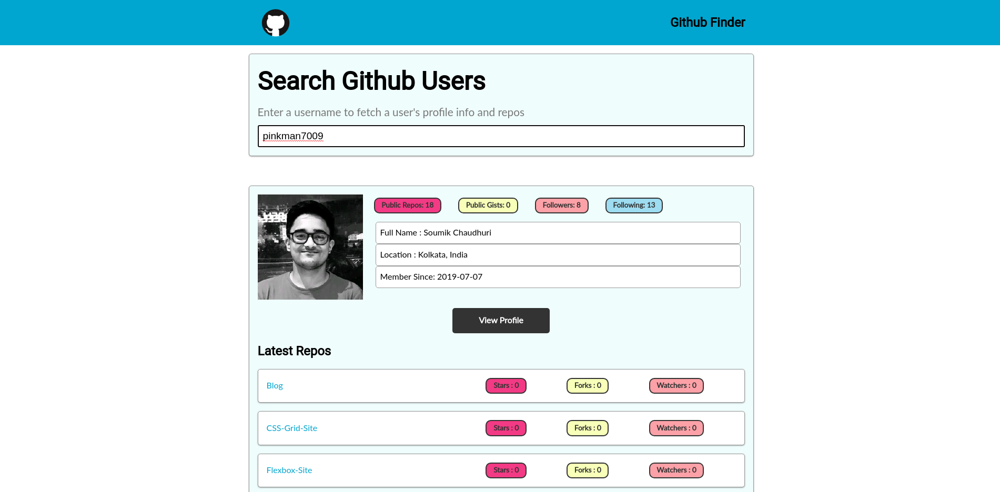
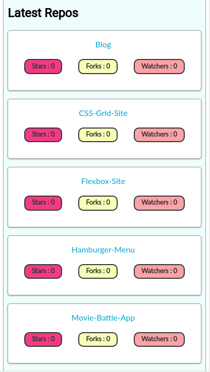

# Github-Finder
This is a Github Finder which allows you to fetch the Github Profile information and repository information of a Github user.

# Features 

1. On entering the Github username of the person, you can fetch the Profile data and data on repositories of the person.
2. Specific links to the Github profile and repositories are provided on the User Interface.

# Screenshots 

## Normal View

## Responsive View on smaller devices 

# Built with :

1. HTML5
2. CSS3
3. Javacript ( Fetch API has been used to fetch the User data )

# Link to the site :
https://pinkman7009.github.io/Github-Finder/
